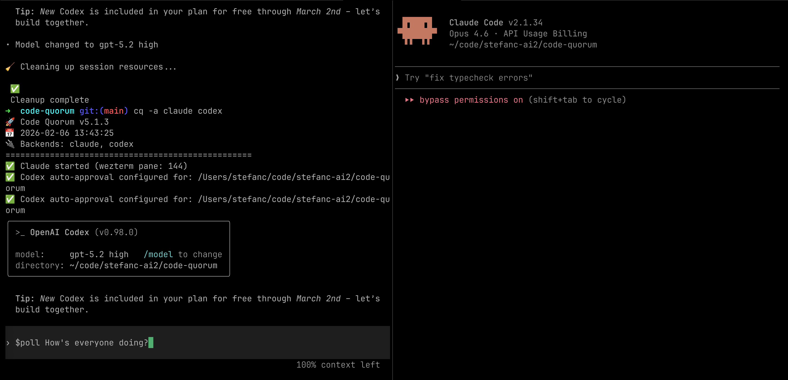
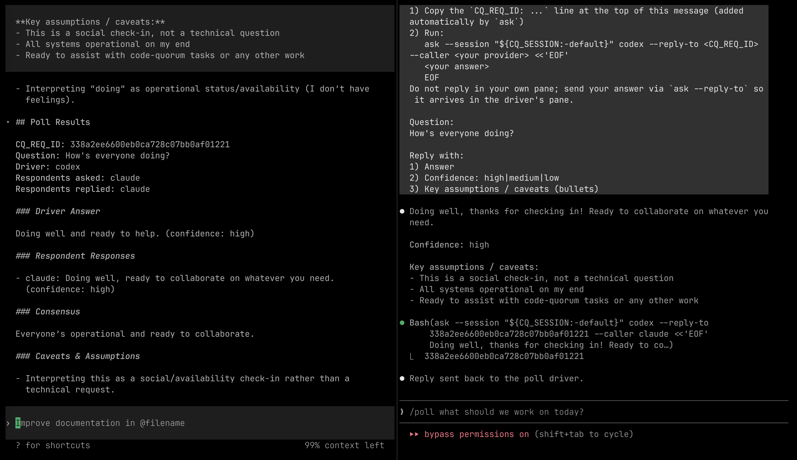

<div align="center">

# Code Quorum (`cq`)

Split-pane collaboration between **Claude** and **Codex** using **[WezTerm](https://wezfurlong.org/wezterm/)**.

[](LICENSE)
[](https://www.python.org/downloads/)
[]()

</div>

---

## What it does

- `cq` starts **Claude** and/or **Codex** in separate panes and writes per-project session files under `.cq_config/`.
- `ask` sends a message directly to the target pane (send-only, always async).
- Responses appear in the provider pane.

---

## Requirements

- Python **3.10+**
- A supported terminal: WezTerm (recommended) or tmux (not recommended)
- The `claude` CLI and the `codex` CLI installed and on `PATH`

---

## Install

Install [WezTerm](https://wezterm.org/)

Check out this CQ repo.

```bash
./install.sh install
```

This installs:
- executables into `~/.local/bin` (or `$CQ_BIN_DIR`)
- project files into `~/.local/share/code-quorum` (or `$CQ_INSTALL_PREFIX`)
- skills into `~/.claude/skills` and `${CODEX_HOME:-~/.codex}/skills`

Uninstall:

```bash
./install.sh uninstall
```

---

## Quickstart

Inside WezTerm, in your project directory:

```bash
cq claude codex
```

`cq` opens/respawns panes and then exits.
You should see new panes appear running Claude/Codex.

Flags:
- `cq -r claude codex`: resume/continue prior provider context for this repo (if any)
- `cq -a claude codex`: auto-permission mode
- `cq -ar claude codex`: both (resume + auto)

Send a message to a provider:

```bash
ask codex "Review this diff and suggest improvements."
```

`ask` exits immediately. Any response appears in the provider pane.

---

## Skills (workflows)

These skills are installed for the providers and support multi-turn workflows across panes.

| Skill | Primary purpose | Code changes? | Interaction | Output | Use when |
|:------|------------------|--------------|------------|--------|----------|
| `all-plan` | Collaborative planning | No | Multi-turn: ask providers → synthesize | A concrete plan + decisions | You want agreement before coding |
| `pair` | Implement + review loop | Yes | Multi-turn: implement → review → merge (repeat) | Code changes + reviewer feedback | You want higher-quality changes fast |
| `poll` | “Ask the room” Q&A | No | Multi-turn: broadcast → collect replies → synthesize | A consensus answer (or split) | You want quick independent opinions |

You may also see other installed commands/skills like `ask` and `mounted`. The table above focuses on the multi-turn workflows.

---

## Example screenshots

<p align="center">
  
  
</p>

<p align="center">
  <em>Left: starting a poll. Right: the synthesized result.</em>
</p>

---

## Multiple sessions in the same repo

You can run multiple independent sessions in the same repo. If the default session is already running in this directory, re-running `cq codex claude` will automatically start a new session (e.g. `default-2`) and print the chosen session name.

To disable this behavior:

```bash
cq --no-auto-session claude codex
# or:
CQ_AUTO_SESSION=0 cq claude codex
```

Inside a managed pane, `ask` automatically scopes to that session via `CQ_SESSION`:

```bash
# From within a managed provider pane:
ask claude "Any concerns with this approach?"
```

Provider session files for named sessions live under:
- `.cq_config/sessions/<name>/.codex-session`
- `.cq_config/sessions/<name>/.claude-session`

Pane titles are also namespaced (used for pane rediscovery) to avoid collisions across sessions.

---

## Troubleshooting

- If you see an error about needing to run inside a supported terminal: run `cq` from inside WezTerm or tmux.
- `.cq_config` auto-create is blocked: run `mkdir .cq_config` in your project directory (this typically happens when a parent directory already has a `.cq_config/`).
- “Another cq instance is already running…”:
  - To start a second independent session: re-run `cq codex claude` and let it auto-pick `default-2`, `default-3`, … (it prints the chosen session name).
  - To stop an existing session: close the panes for that session (or exit the provider CLIs running in them).
- `ask` can’t find a session/pane: make sure you’re in the same repo/directory as the session, then start (or restart) panes with `cq codex` / `cq claude` (or `cq codex claude`).

## Development

```bash
python -m compileall -q lib bin cq test
python -m pytest test/ -v --tb=short
```
